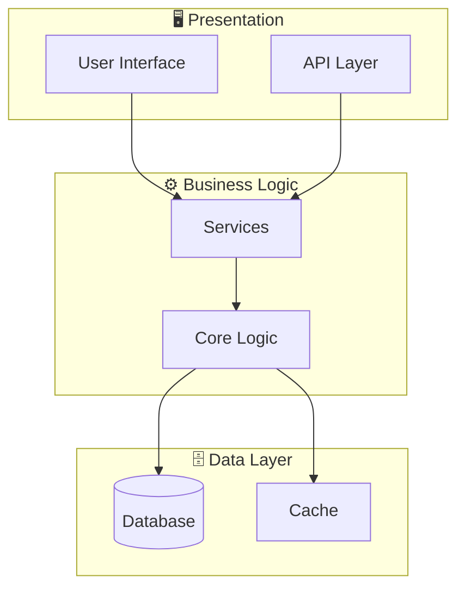
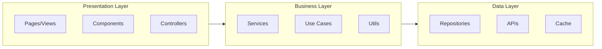

# System Architecture - 78726470-e48f-42a0-8d14-15faa7b49bb0

## Architecture Overview

**Pattern:** Monolithic with potential separation of concerns using components. It's likely a React application built with Vite.



## Application Layers



## Technology Stack

| Layer | Technology | Purpose |
|-------|------------|---------|
| Language | TypeScript | Main language |
| Framework | Vite | Main framework |

## Directory Structure

```
landingpage/
├── vite.config.ts/
├── index.tsx/
├── components/
├── App.tsx/
├── types.ts/
└── (13 files)
postcss.config.js/
src/
├── vite-env.d.ts/
├── main.tsx/
├── public/
├── auth/
├── App.tsx/
└── ... (+1 more)
tailwind.config.js/
vite.config.d.ts/
vite.config.ts/
```

---

*Generated by Code Analysis Agent on February 11, 2026*
