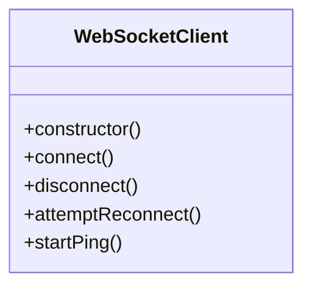

# Class Diagram - 78726470-e48f-42a0-8d14-15faa7b49bb0

## Domain Model

## Entity Descriptions

### WebSocketClient

Location: `src/shared/lib/websocket.ts`

---

*Generated by Code Analysis Agent on February 11, 2026*
