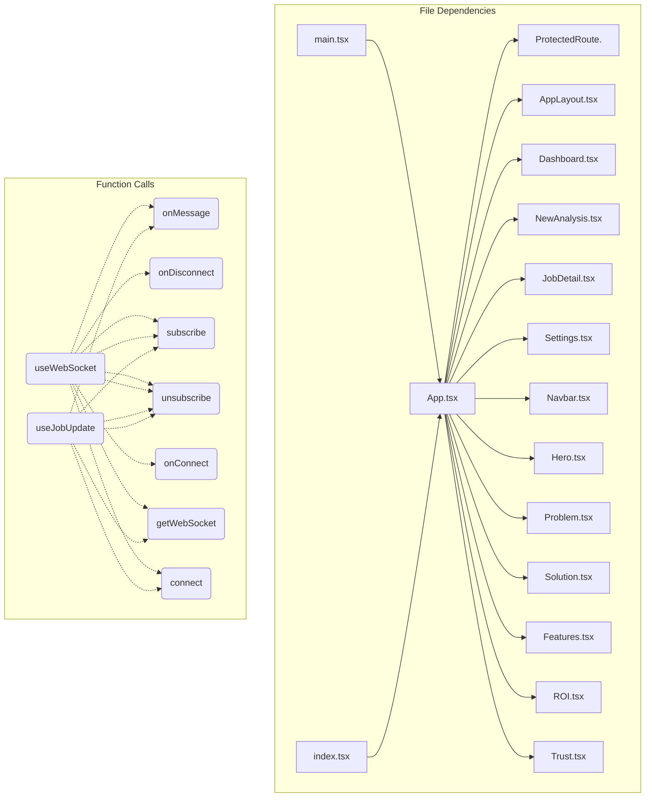

# Dependency Graph - 78726470-e48f-42a0-8d14-15faa7b49bb0

## Statistics

| Metric | Value |
|--------|-------|
| Total Files | 75 |
| Total Functions | 58 |
| Total Classes | 1 |

## Overview

## Most Connected Modules

- **src/shared/lib/utils.ts**: 26 connections
- **src/shared/lib/api.ts**: 20 connections
- **function:src/shared/lib/api.ts:fetchApi**: 16 connections
- **src/shared/lib/websocket.ts**: 16 connections
- **function:src/auth/hooks/useWebSocket.ts:useWebSocket**: 10 connections
- **function:src/shared/lib/websocket.ts:connect**: 8 connections
- **src/App.tsx**: 8 connections
- **landingpage/App.tsx**: 8 connections
- **src/auth/hooks/useJobs.ts**: 7 connections
- **function:src/auth/hooks/useWebSocket.ts:useJobUpdates**: 7 connections

---

*Generated by Code Analysis Agent on February 11, 2026*
